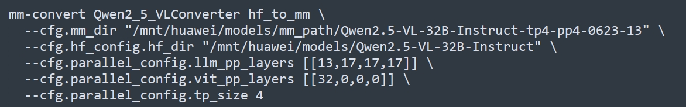
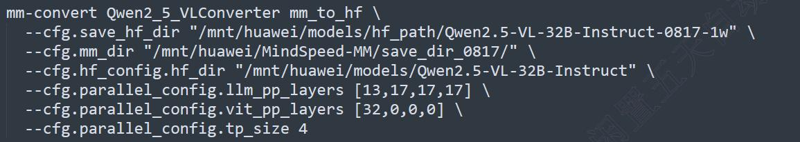

# 基于Qwen2.5-VL的病理多模态大模型监督微调实践

## 一、环境安装

### 环境准备

请参考[安装指南](https://gitee.com/ascend/MindSpeed-MM/blob/master/docs/user-guide/installation.md)，完成昇腾训练软件安装。

### 环境搭建

```
git clone https://gitee.com/ascend/MindSpeed-MM.git
git clone https://github.com/NVIDIA/Megatron-LM.git
cd Megatron-LM
git checkout core_v0.12.1
cp -r megatron ../MindSpeed-MM/
cd ..
cd MindSpeed-MM
mkdir logs data ckpt
# 安装加速库
git clone https://gitee.com/ascend/MindSpeed.git
cd MindSpeed
# checkout commit from MindSpeed core_r0.12.1
git checkout 5176c6f5f133111e55a404d82bd2dc14a809a6ab
# 安装mindspeed及依赖
pip install -e .
cd ..
# 安装mindspeed mm及依赖
pip install -e .
```

## 二、预训练模型准备

### 权重下载

以[Qwen2.5-VL-32B](https://huggingface.co/Qwen/Qwen2.5-VL-32B-Instruct/tree/main)为例，从Huggingface库下载对应的模型权重:

* 模型地址: [Qwen2.5-VL-32B](https://huggingface.co/Qwen/Qwen2.5-VL-32B-Instruct/tree/main)；

将下载的模型权重保存到本地的 `ckpt/hf_path/Qwen2.5-VL-32B-Instruct`目录下。

### 权重转换(hf2mm)

使用 `mm-convert`工具对原始预训练权重进行转换。该工具实现了huggingface权重和MindSpeed-MM权重的互相转换以及PP（Pipeline Parallel）权重的重切分。（参考[权重转换工具](https://gitee.com/ascend/MindSpeed-MM/blob/master/docs/features/%E6%9D%83%E9%87%8D%E8%BD%AC%E6%8D%A2%E5%B7%A5%E5%85%B7.md)）



```
# 其中：
# mm_dir: 转换后保存目录
# hf_dir: huggingface权重目录
# llm_pp_layers: llm在每个卡上切分的层数，注意要和model.json中配置的pipeline_num_layers一致
# vit_pp_layers: vit在每个卡上切分的层数，注意要和model.json中配置的pipeline_num_layers一致
# tp_size: tp并行数量，注意要和微调启动脚本中的配置一致
```

以上是TP4PP4切分后的权重转换参考命令，如果未切分可以执行命令：

```
mm-convert  Qwen2_5_VLConverter hf_to_mm \
  --cfg.mm_dir "ckpt/mm_path/Qwen2.5-VL-32B-Instruct" \
  --cfg.hf_config.hf_dir "ckpt/hf_path/Qwen2.5-VL-32B-Instruct" \
  --cfg.parallel_config.llm_pp_layers [[1,9,9,9,9,9,9,9]] \
  --cfg.parallel_config.vit_pp_layers [[32,0,0,0,0,0,0,0]] \
  --cfg.parallel_config.tp_size 2
```

### 权重转换(mm2hf)

在微调后，如果需要将权重转回huggingface格式，可使用 `mm-convert`权重转换工具对微调后的权重进行转换，将权重名称修改为与原始网络一致。



### 权重切分

如果需要对权重重新进行切分，可使用 `mm-convert`权重转换工具对权重进行切分。

参考命令：

```
mm-convert  Qwen2_5_VLConverter resplit \
  --cfg.source_dir "ckpt/mm_path/Qwen2.5-VL-32B-Instruct" \
  --cfg.target_dir "ckpt/mm_resplit_pp/Qwen2.5-VL-32B-Instruct" \
  --cfg.source_parallel_config.llm_pp_layers [1,9,9,9,9,9,9,9]  \
  --cfg.source_parallel_config.vit_pp_layers [32,0,0,0,0,0,0,0] \
  --cfg.source_parallel_config.tp_size 2 \
  --cfg.target_parallel_config.llm_pp_layers [13,17,17,17] \
  --cfg.target_parallel_config.vit_pp_layers [32,0,0,0] \
  --cfg.target_parallel_config.tp_size 4
# 其中
# source_dir: 微调后保存的权重目录
# target_dir: 希望重新pp切分后保存的目录
# source_parallel_config.llm_pp_layers: 微调时llm的pp配置
# source_parallel_config.vit_pp_layers: 微调时vit的pp配置
# source_parallel_config.tp_size: 微调时tp并行配置
# target_parallel_config.llm_pp_layers: 期望的重切分llm模块切分层数
# target_parallel_config.vit_pp_layers: 期望的重切分vit模块切分层数
# target_parallel_config.tp_size: 期望的tp并行配置（tp_size不能超过原仓config.json中的num_key_value_heads
```

## 三、数据准备

### 数据下载

下载开源病理ROI图文对数据，也可以准备自己的病理图文对数据。

开源ROI图文对数据地址：

* [PathGen-Instruct](https://huggingface.co/datasets/jamessyx/PathGen-Instruct)
* [PathInstruct](https://huggingface.co/datasets/jamessyx/PathGen-Instruct)
* [PathGen](https://huggingface.co/datasets/jamessyx/PathGen)

### 数据构造

在数据构造时，对于包含图片的数据，构造格式如下：

```
{
  "id": your_id,
  "image": your_image_path,
  "conversations": [
      {"from": "human", "value": your_query},
      {"from": "gpt", "value": your_response},
  ],
}
```

对于纯文本数据，可以去除 `image`这个键值，构造格式如下：

```


  "id": your_id,
  "conversations": [
      {"from": "human", "value": your_query},
      {"from": "gpt", "value": your_response},
  ],
}
```

## 四、监督微调
