# 场景1: 基于 ModelEngine 复现 RuiPath 辅助诊断任务

## 一、基于 ModelEngine 部署 RuiPath 视觉基础模型

RuiPath 计算病理学辅助诊断推理服务部署需要下载推理服务运行环境容器镜像和瑞金医院开源的视觉基础模型权重。

### 1. 镜像下载

下载地址：[点此前往](https://ruipath-image.obs.ap-southeast-1.myhuaweicloud.com:443/ruipath.zip?AccessKeyId=HPUAD8EHADYJSZGYIQBR&Expires=1791528247&Signature=p0D3t1595Rw7DAOMElzC730FC1k%3D)。

然后将压缩包传入 ModelEngine 的所有节点。

### 2. 视觉基础模型下载

RuiPath 视觉基础模型是瑞金医院开源的 ViT 模型，请访问 RuiPath 病理视觉基础模型 V1.0 申请，待瑞金医院审核批准后下载。

### 3. 在 ModelEngine 部署 RuiPath

#### 3.1 上传权重

在 ModelEngine 模型仓库中新增一个自定义类型的模型类型，点击“确定”创建模型。

<p align="center">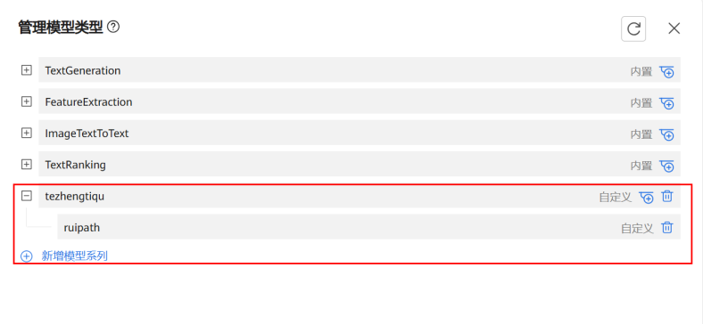</p>

然后新增一个 RuiPath 模型并上传权重。

<p align="center">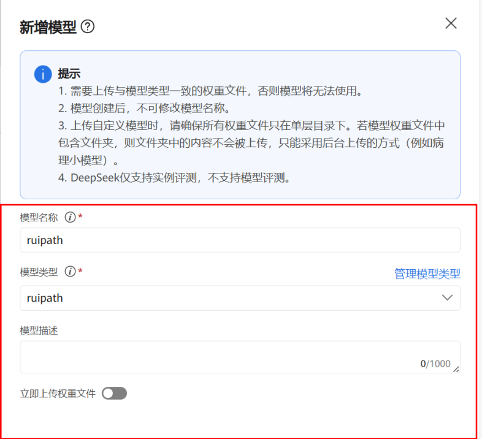</p>

通过后台上传本地权重文件，前提条件请参考章节“准备模型权重文件 > 挂载模型路径”。

通过 NFS 或 CIFS 协议上传模型权重。

<p align="center">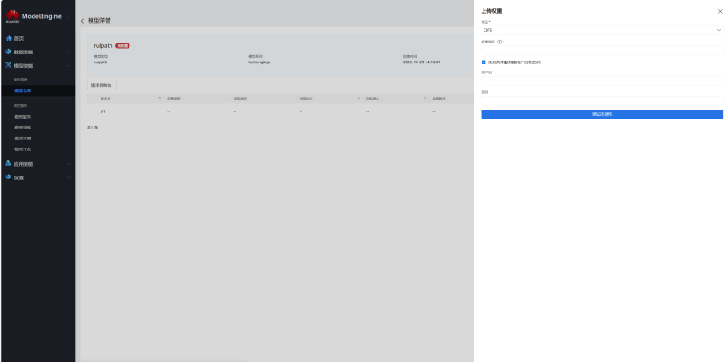</p>

权重上传完成后，支持模型自定义部署。

<p align="center">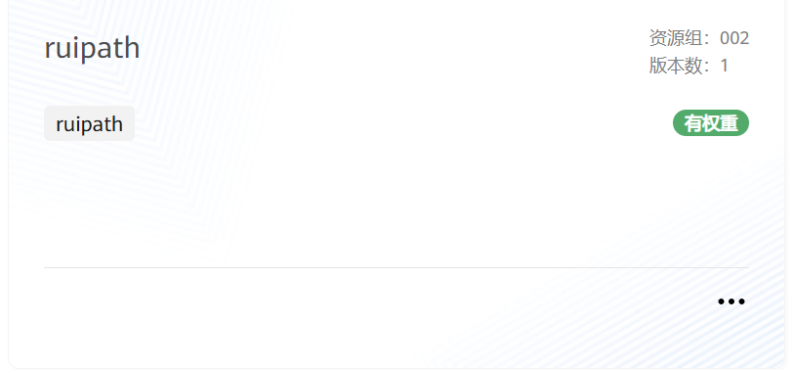</p>

#### 3.2 加载推理镜像

首先下载压缩包并执行解压：

```bash
unzip ruipath.zip
```

解压后在每个节点执行：

```bash
docker load -i ruipath.tar
```

在上传镜像的文件目录下，执行以下命令导入镜像，确保所有计算节点上有 RuiPath 推理镜像：

```bash
docker load -i ruipath1.tar
```

确认推理节点上镜像已就绪：

```bash
docker images | grep ruipath
```

<p align="center">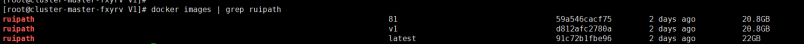</p>

节点上有 `ruipath:81` 镜像后，可以正常拉起 Pod。

<p align="center">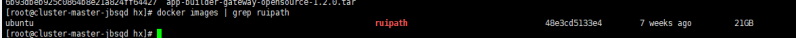</p>

#### 3.3 在存储创建 NFS 共享

进入存储 DeviceManager，选择“服务”->“文件系统”->“共享”。

在 NFS 共享页面点击“创建”，选择“文件系统”。若没有已创建的文件系统，点击“创建”，进入如下页面：

填入文件系统“名称”，选择“所属存储池”，根据需要填入合适的“容量”大小，点击“确认”，完成文件系统创建。

<p align="center">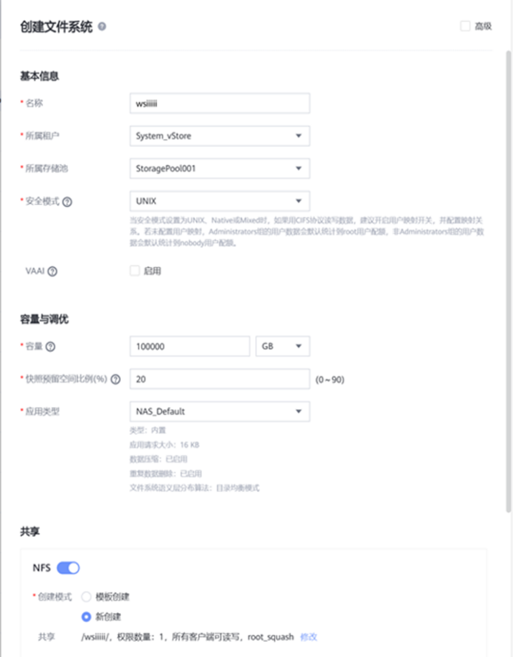</p>

然后点击上图最下面 NFS 的修改，进入 NFS 共享界面。

<p align="center">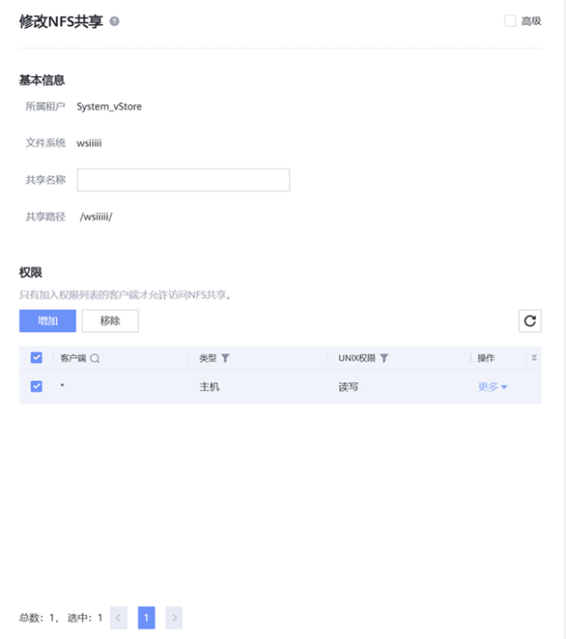</p>

如果没有客户端，则新增一个客户端：

1. 类型选择“主机”。
2. “客户端”填入能访问的客户端 IP；若想要所有客户端都可访问，可填入 `*`。
3. UNIX 权限选择“读写”。
4. root 权限限制选择 `no_root_squash`。
5. 点击“确认”，完成 NFS 共享创建。

<p align="center">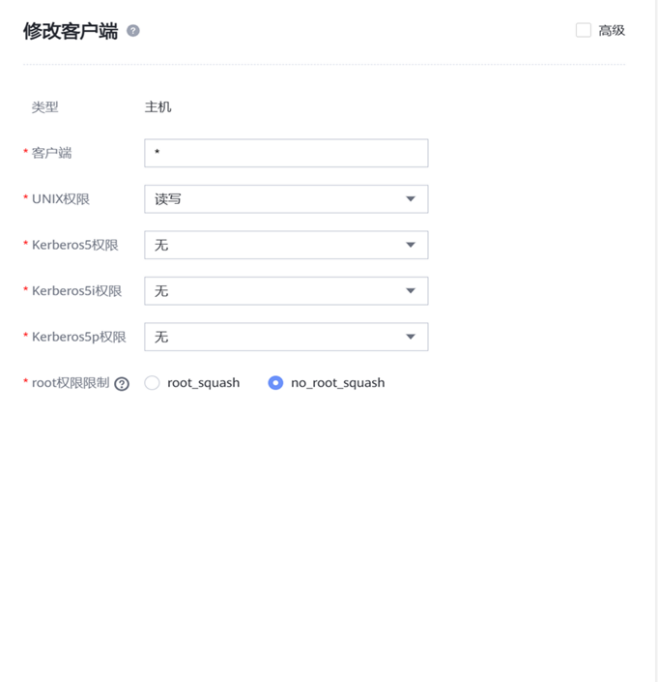</p>

#### 3.4 存储挂载

运行挂载脚本（`xxx.xxx.xxx.xxx` 为存储 IP）：

```bash
bash mount.sh xxx.xxx.xxx.xxx
```

注：所有宿主机都需要执行路径创建和存储挂载步骤。

<p align="center">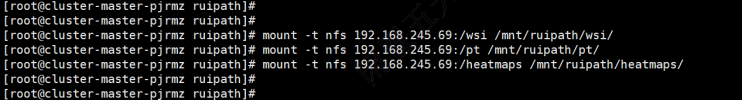</p>

#### 3.5 下发推理

在 ModelEngine 前端点击“模型服务”部署模型，参数按需填写（模型节点数量、实例数量、卡数等）。填写完成后执行脚本 `start.sh`。

注意：脚本需要在 master 节点运行。

<p align="center">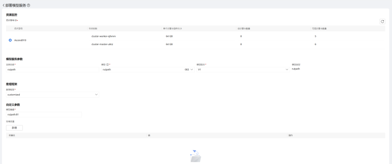</p>

命令示例：

```bash
bash start.sh -d ruipath1-inference -n model-engine -p xxx.xxx.xxx
```

参数说明：

- `-d, --deployment`：Deployment 名称（必须）
- `-n, --namespace`：命名空间（必须）
- `-p, --ip`：IP 地址（默认：`0.0.0.0`），需要填写 k8s 主节点 IP
- `-h, --help`：显示帮助信息

运行脚本后，结果如下所示代表正常：

<p align="center">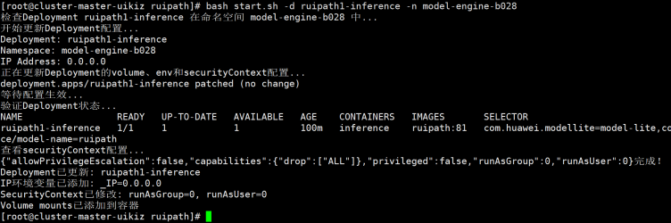</p>

执行以下命令，若存在 Running 状态的 RuiPath Pod，则代表正常：

```bash
kubectl get pod -n model-engine
```

<p align="center">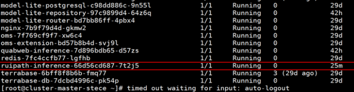</p>

#### 3.6 测试接口连通性（非必需）

首先在宿主机上执行以下命令查询 Pod 状态，并找到 RuiPath Pod 的 IP（示例：`10.133.89.255`）：

```bash
kubectl get pod -n model-engine -o wide
```

<p align="center">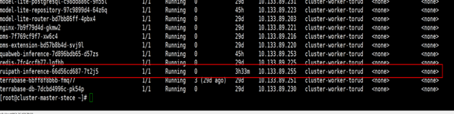</p>

然后找一张 WSI 图片，将请求中的 IP 改为刚才查询到的 IP，并将请求体中的 `wsi_relative_path` 写成该 WSI 图片路径。

```bash
curl -X POST "http://10.133.89.255:9981/ruipath/v1/inference" \
	-H "Content-Type: application/json" \
	-d '{
		"wsi_relative_path": "/mnt/ruipath/wsi/20250422/763f017ed6fce100a97efc11fd259471/2025-039058#10#1.svs",
		"case_id": "1412685",
		"wsi_id": "3350863",
		"wsi_format": "svs",
		"cancer_category": "breast",
		"organ": "breast",
		"timeout": 3600,
		"heatmap_relative_path": "/mnt/ruipath/heatmaps/"
	}'
```

结果如下所示：

<p align="center">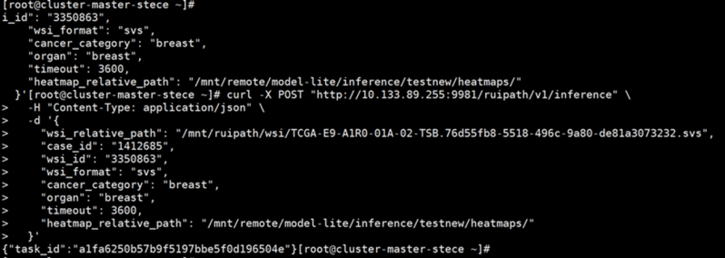</p>

然后执行：

```bash
cd /mnt/ruipath/pt/logs/breast/
vim progress_a1fa6250b57b9f5197bbe5f0d196504e_create_patches.log
```

`vim` 后面接任务名称，出现下图代表正常。

<p align="center">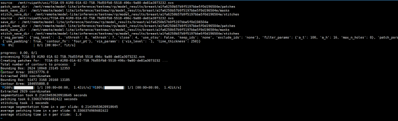</p>

## 二、在 ModelEngine 部署大语言模型

### 1. 上传权重

- 在 ModelEngine 模型仓库中，新增模型并填写模型名称。
- 选择模型类型为“Qwen2.5-32B-Instruct”，点击“确定”创建模型。

<p align="center">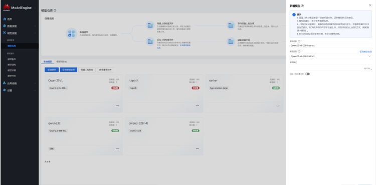</p>

- 通过 NFS 或 CIFS 协议上传模型权重。

<p align="center">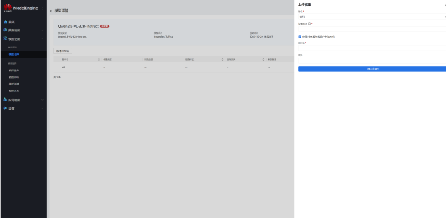</p>

- 权重上传完成后可用于部署。

<p align="center">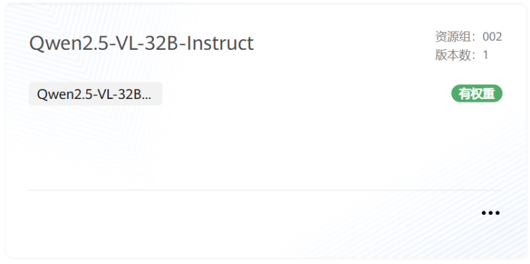</p>

### 2. 部署模型

- 确保所有节点上有 mindie 镜像。
- 在 ModelEngine 模型服务中部署模型，进入模型实例下发页面。
- 按下列参数部署模型，“实例名称”需指定为“ruipath-32-llm”，否则病理应用调用不通。

<p align="center">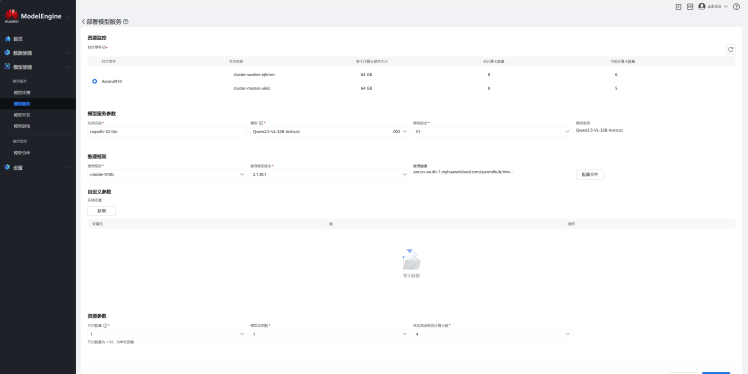</p>

- 等待 5~10 分钟后，模型可访问。

<p align="center">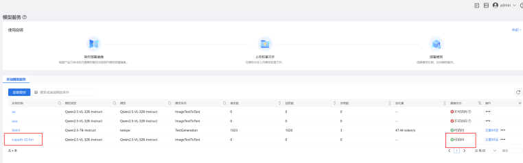</p>
