# 场景2: 基于 ModelEngine 下游任务训练

## 准备工作

### 准备医院数据

首先，需要获得医院病理系统 PIS 系统（病理科病例管理系统）和 MIS 系统（病理科影像管理系统）的连接和查询方式。DataMate 支持关系型数据库的表/视图查询，亦可以选择使用JSON数据格式的 RESTful API 接口进行查询。两种方法所需的连接和查询信息如下：

1. 数据库查询：
   1. 数据库连接URL、用户名（User）、密码（Password）
   2. SQL查询语句（Query）
2. API查询：
   1. 接口地址（URL）、请求方式（GET/POST/）
   2. 请求体参数（Body）、请求头参数（Header）
   3. 数据解析（Schema）

我们需要从 PIS 系统和 MIS 系统中获取的数据如下：
1. 从PIS系统获取的数据：以病例为维度，病理号、病理报告、取材部位
2. 从MIS系统获取的数据：以数字病理切片为维度，病理号、病理切片号、数字切片路径、缩略图路径（当数字切片为SDPC格式时需要）

### 准备 DataMate 工作环境

病理系统数据预处理算子准备：从 [DataMate-Ops](https://github.com/JasonW404-HW/DataMate-Ops) 下载 main 分支代码为 zip 文件，解压后将 patho_sys_preprocess/ 文件夹下所有内容，打包为 .zip 或 .tar 压缩包文件，确保压缩包名称为 patho_sys_preprocess.zip 。进入 DataMate - 算子市场 页面，将该算子上传到 DataMate 算子市场 中，并发布。

DataMate 运行环境变更：因为数字病理切片的文件体积较大，且数量较多，本最佳实践中采用的数据准备方式为文件软连接形式。即，数字病理切片及其缩略图并不会传输到 DataMate 的服务器或关联的存储中，而是通过将 医院病理系统图像存储 挂载到 DataMate 运行环境中，通过创建文件软链接进行关联管理的方法。因此，需要做如下环境变更操作：

1. 在主机上完成对 医院病理系统图像存储 的挂载，建议挂载在 `/mnt` 目录下。注意，如果是多主机集群，请确保所有主机上都完成了挂载。
2. 修改 DataMate 安装部署配置，将 医院病理系统图像存储 在主机上的路径，挂载到 POD 中，并记录该存储在 POD 中的路径。需要挂载的 POD 包括：`datamate-backend`, `datamate-runtime`, `datamate-backend-python`, `label-studio`。

具体的操作步骤如下：

医院病理图像存储在主机 `/mnt` 下的某个挂载点（例如 `/mnt/pathology`），需要以 `hostPath` 方式挂载到4个 POD 中。按照当前 Helm 配置架构，所有修改集中在如下文件中：

- `deployment/helm/datamate/values.yaml`：控制backend、runtime、backend-python
- `deployment/helm/label-studio/values.yaml`：控制 label-studio
- `deployment/helm/label-studio/templates/deployment.yaml`：label-studio 的 deployment 模板（需要添加 hostPath volume 支持）

1. 确认主机挂载点路径：在每个 Kubernetes 节点上确认病理图像的实际路径。假设实际路径为 `/mnt/pathology`，POD 内挂载路径统一使用 `/data/pathology`。
   
    ```bash
    ls /mnt/pathology   # 或 /mnt/wsi-images 等实际挂载点名称
    ```

2. 修改 datamate 主 values.yaml：
在 values.yaml 中，在顶部 YAML anchor 区域新增一个 hostPath volume anchor，然后分别追加到 backend、backend-python、runtime 的 volumes 和 volumeMounts 中：

    ```yaml
    # 在现有 operatorVolume anchor 后新增：
    pathologyVolume: &pathologyVolume
    name: pathology-volume
    hostPath:
        path: /mnt/pathology   # ← 替换为实际主机路径
        type: Directory

    # 在 backend.volumes 中追加：
    backend:
    volumes:
        - *datasetVolume
        - *flowVolume
        - *logVolume
        - *operatorVolume
        - *pathologyVolume        # ← 新增
    volumeMounts:
        - name: dataset-volume
        mountPath: /dataset
        - name: flow-volume
        mountPath: /flow
        - name: log-volume
        mountPath: /var/log/datamate
        - name: operator-volume
        mountPath: /operators
        - name: pathology-volume  # ← 新增
        mountPath: /data/pathology
        readOnly: true          # 建议只读，避免误操作
    # backend-python 和 runtime 同理追加相同两项
    ```
3. 第三步：修改 label-studio 的 values.yaml 和 deployment 模板
    values.yaml 新增：
    ```yaml
    pathologyVolume:
    enabled: true
    hostPath: /mnt/pathology   # ← 替换为实际主机路径
    mountPath: /label-studio/local/pathology
    ```

    deployment.yaml 中追加：

    ```yaml
    # volumeMounts 区域追加：
            - name: pathology
                mountPath: /label-studio/local/pathology
                readOnly: true   # 建议只读

    # volumes 区域追加：
            {{- if .Values.pathologyVolume.enabled }}
            - name: pathology
            hostPath:
                path: {{ .Values.pathologyVolume.hostPath }}
                type: Directory
            {{- end }}
    ```

    注意：label-studio 的 `LOCAL_FILES_DOCUMENT_ROOT` 已设为 `/label-studio/local`，病理图像放在其子目录 `/label-studio/local/pathology` 下，label-studio 可以直接通过 Local Storage 访问。

4. 确认各 POD 中的存储路径

    | POD                     | 主机路径       | POD 内路径                    | 权限 |
    | ----------------------- | -------------- | ----------------------------- | ---- |
    | datamate-backend        | /mnt/pathology | /data/pathology               | 只读 |
    | datamate-runtime        | /mnt/pathology | /data/pathology               | 只读 |
    | datamate-backend-python | /mnt/pathology | /data/pathology               | 只读 |
    | label-studio            | /mnt/pathology | /label-studio/local/pathology | 只读 |

## 训练数据准备

### 数据归集

这一部分的操作目的，是为了将医院病理科业务系统中的数据，以结构化数据的形式，导入到 DataMate 中，便于后续处理和使用。

1. 进入 DataMate - 数据归集 页面，点击 创建任务 。
2. 填入任务名称（不影响任务执行），根据数据查询的方式，选择正确的归集模板：
   1. 通过API查询：选择 API 归集模板
   2. 通过关系型数据库查询：选择 MySQL 归集模板 或 通用关系型数据库归集模板 。
3. 等待归集结束。进入 DataMate - 数据管理 页面，点击 创建数据集。
4. 填写数据集名称，选择合适的数据集类型（文本），关联 步骤 1-3 中创建并运行完成的数据归集任务。点击 确定，创建数据集。

> ‼️ **注意**：为了后续归集数据的清洗能正确执行，请对PIS系统和MIS系统分别设置归集任务，并将归集结果写入同一数据集中。

**预期结果**: 在对应数据集中，能看到两个 CSV 文件。

### 数据清洗

1. 进入 DataMate - 数据处理 页面，点击 创建模板 ，创建 “病理数据归集清洗” 模板。注意，该模板中仅需勾选一个“病理系统数据预处理”算子。保存并创建模板。
2. 进入 DataMate - 数据处理 页面，点击 创建任务 ，创建 “病理图片归集“任务。
3. 选择之前创建的“病理数据归集清洗”模板，创建清洗任务，等待清洗完成。

**预期结果**：在目标数据集“WSI归集”中，可以看到有若干 数字病理切片 和 数字病理切片的预览图 （如果有SDPC文件）。

> 至此，病理场景数据准备已经完成，您可以进入下一步 *基于ModelEngine下游任务训练* 。

## 基于ModelEngine下游任务训练

### 前置准备

1. 准备数据集。
2. 准备镜像。 [下载链接](https://ruipath-image.obs.ap-southeast-1.myhuaweicloud.com:443/jupyter.zip?AccessKeyId=HPUAD8EHADYJSZGYIQBR&Expires=1792054102&Signature=b1jMORyrHHq/Ol%2BekKGEKTLEwRc%3D)
3. 将压缩包传入 ModelEngine 主节点并解压，解压后会得到一个 `sh` 文件和一个 `tar` 文件。

```bash
unzip jupyter.zip
```

5. 将 `jupyter.tar` 传入 ModelEngine 所有节点，并在每个节点执行：

```bash
docker load -i jupyter.tar
```

### 模型开发实例

1. 在 ModelEngine 前端页面下发模型开发实例任务。

- 内存建议：约为 `2G * 增训图片个数`
- 模型选择：RuiPath 特征提取模型
- 数据集选择：`4.3.2.2.6.2 数据使能归集`中使用的数据集

<p align="center">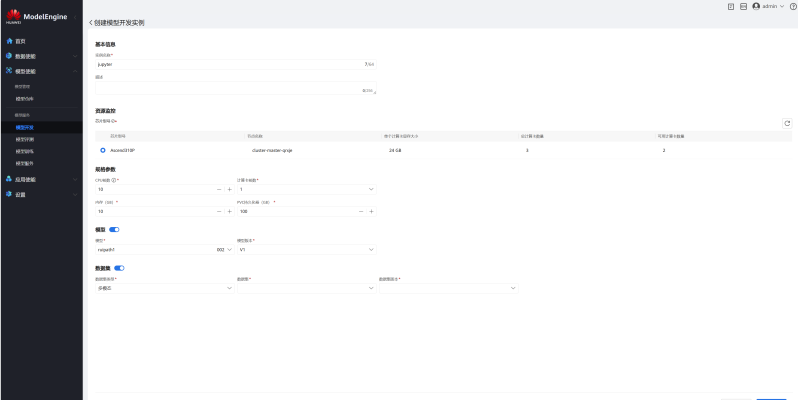</p>

2. 点击确认并输入模型开发实例密码。

<p align="center">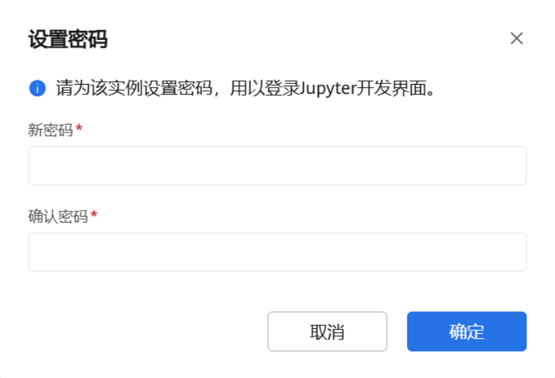</p>

3. 下发成功后，前端会新增模型开发实例。

<p align="center">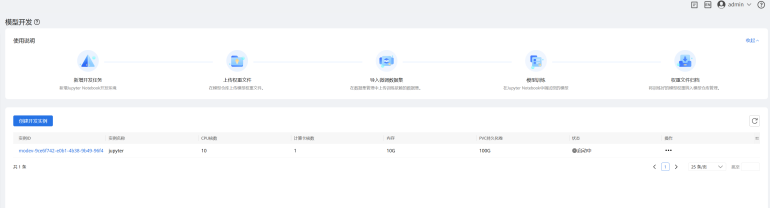</p>

4. 修改所下发模型开发实例的 `Deployment`。

先通过以下命令查看实例 ID，并复制红框部分：

```bash
kubectl get pod -n model-engine
```

<p align="center">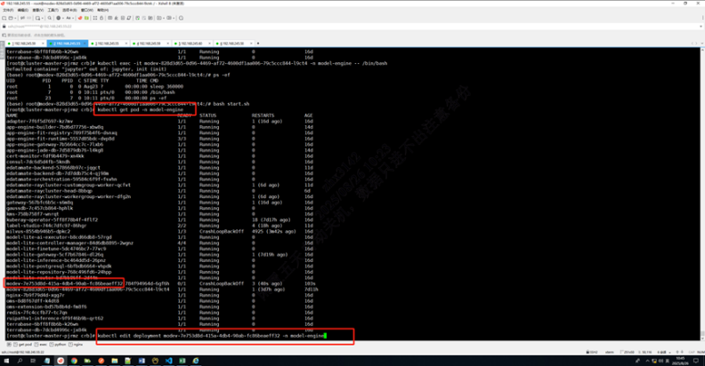</p>

5. 执行脚本：

```bash
bash edit_jupyter.sh <实例id> <命名空间>
```

示例：

```bash
bash edit_jupyter.sh modev-d94a784c-17ff-4d83-84a6-e52d9fa4f1d4 model-engine
```

出现如下结果表示执行成功：

<p align="center">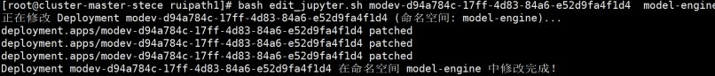</p>

6. 观察实例状态为启动中或已启动。

<p align="center">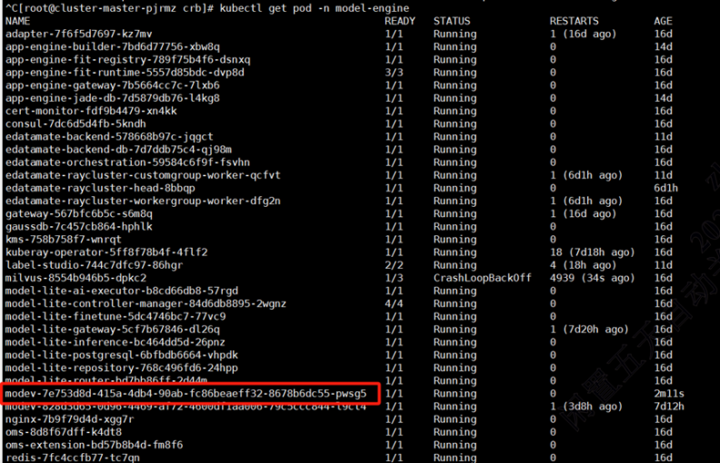</p>

7. 在 `ModelEngine -> 模型使能 -> 模型开发 -> 模型实例` 中，跳转至 Jupyter 开发界面。

<p align="center">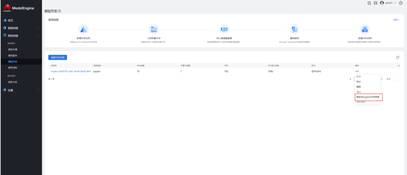</p>

### 模型训练与归档

在 Jupyter 开发页面中，点击进入 `train.ipynb`。

模型训练过程分 4 步：前置准备、数据集准备、模型训练、归档训练权重。

#### 一、前置准备

上传 `train.ipynb`，点击运行代码。

<p align="center">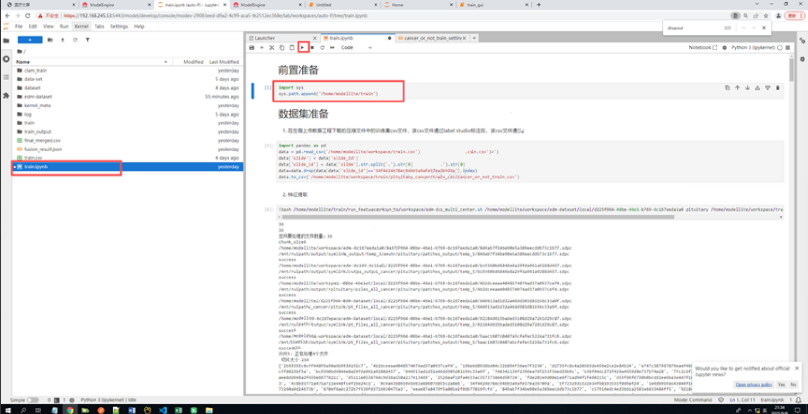</p>

#### 二、数据集准备

1. 在左侧工作目录下上传从数据使能获取的 `csv` 文件。
2. 修改训练集 `csv` 并归档到训练所需路径。
3. 按提示修改脚本参数并进行特征提取。

> 注：癌种名称不要与 `['lung', 'colorectal', 'thyroid', 'stomach', 'breast', 'prostate_biopsy', 'pancreatic']` 中任意一个保持一致。

<p align="center">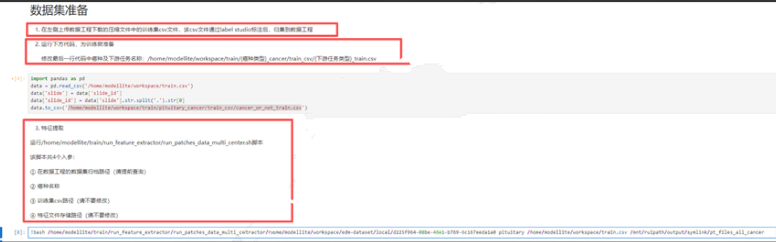</p>

#### 三、模型训练

1. 依次运行代码，获得可视化训练参数输入框。
2. 输入对应参数并启动训练：

- `Cancer Type`：癌种名称，与数据集准备时输入的癌种名称一致。
- `Subtype`：下游任务类型，与数据准备时输入的下游任务类型一致。
- `NPUID`：NPU 序号，在 910 环境上编号从 0 开始，填写 `0`。
- `Model Type`：可选 `clam_sb`（二分类模型）、`clam_mb`（多分类模型）、`clam_mmb`（多分类多标签模型）、`LymphaNodeCounter`（淋巴结计数回归模型）。
- `Model Size`：可选 `big` 或 `small`。两者模型结构相同，区别在中间层维度，建议选择 `big`。
- 其他参数：保留默认值即可。

<p align="center">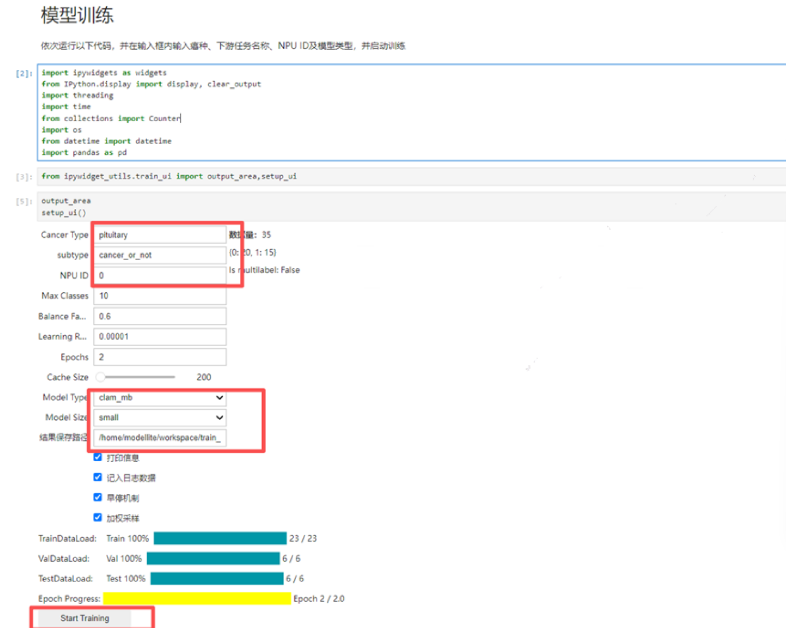</p>

1. 启动训练后会依次打印训练日志；出现 `Trainning Finished` 即为训练成功，且左侧目录下可见 `train_output` 文件夹。

<p align="center">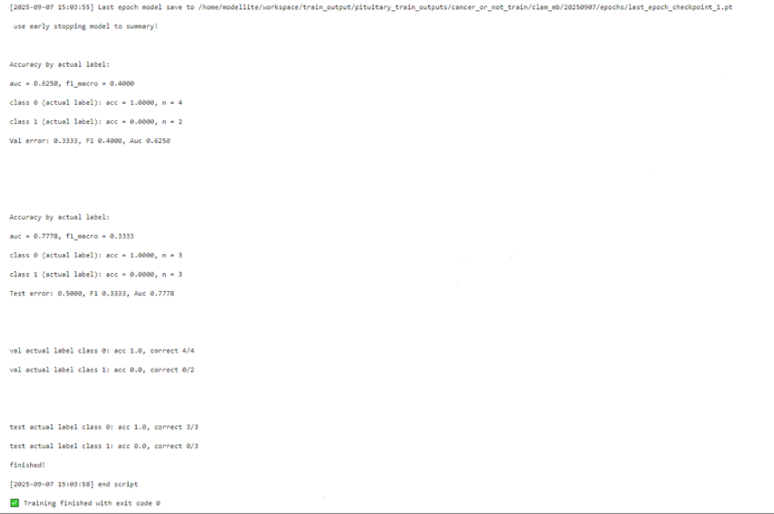</p>

#### 四、归档训练权重

修改红框内信息，并按步骤执行代码。

<p align="center">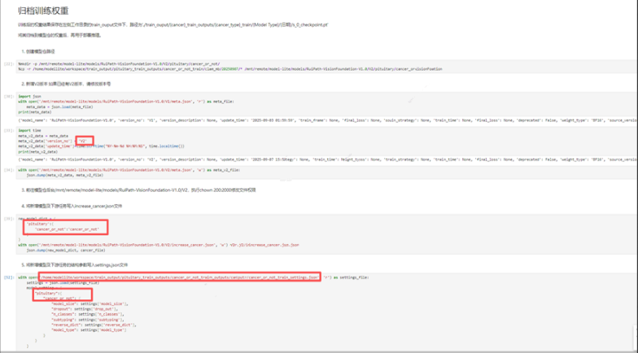</p>

### 模型推理

1. 部署时，选择权重归档时对应的版本。
2. 进入容器后，修改 `/home/modellite/code/utils/network_util.py` 下的 WSI 路径及癌种信息并测试调用。

<p align="center">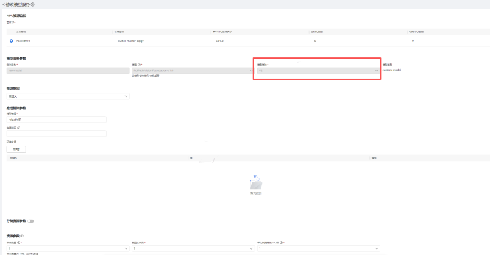</p>
<p align="center">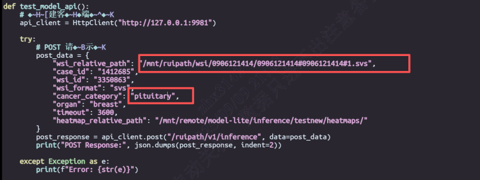</p>